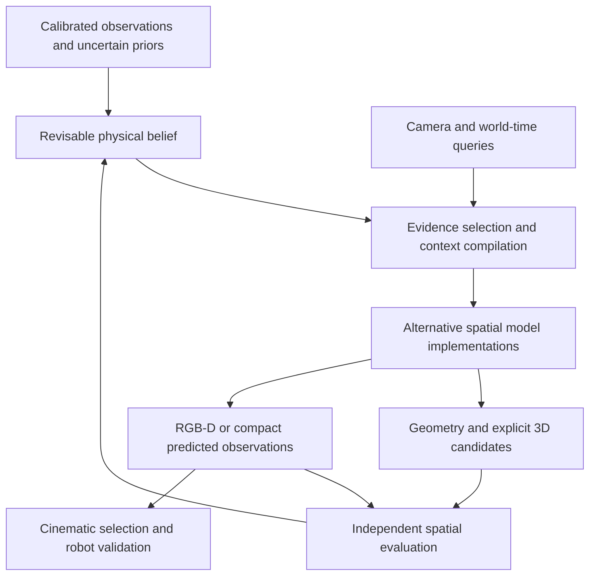

# From Camera-Controlled Video to Native Spatial World Models

## A dual-track research program: spatial foundation modeling and executable cinematography

**Version:** 4.0 research-source edition  
**Date / evidence cut-off:** 6 September 2026  
**Prepared for:** Recomo Film Brain research  
**Empirical status:** Literature and protocol review; model and robot experiments not run  
**Lineage:** v1/v2 historical editions and v3 audit revision remain unchanged  
**References:** P01–P38 resolve in [SOURCE_REGISTRY.csv](../SOURCE_REGISTRY.csv). The older 71-entry index remains in v3 with its original review qualifications.

## Abstract

Camera-aware generation is not a single task and cannot be evaluated by a single league table. It spans calibrated image formation, sparse-view geometry, novel-view synthesis, dynamic refilming, uncertain future prediction, persistent memory and interactive world construction. A useful research program must compare these capabilities independently while investigating whether a common learned spatial representation can improve several of them together. The program should neither copy a proprietary architecture from a short disclosure nor retreat into an application-only shot-ranking system.

Version 4 therefore establishes two connected tracks. Track A studies native spatial modeling: representations, geometric conditioning, joint reconstruction and generation, temporal dynamics, memory, and controllable world creation. Track B uses Recomo as a calibrated experimental platform for prediction, evidence acquisition, cinematic planning and physical execution. Application results constrain engineering investment but do not replace foundation-model questions. The paper expands Atlas's exact reconstruction comparison set, incorporates protocol-qualified numerical evidence, restores previously missing benchmark and architecture families, and replaces generic novelty claims with falsifiable hypotheses. A source index, coverage ledger, result records, experiment specifications and version safeguards make the status of each claim inspectable. No reported literature result is presented as a Recomo reproduction.

## Executive position

Our target is a spatial model that can reconstruct what is supported by observations, represent uncertainty where support is incomplete, generate coherent alternatives where imagination is authorized, and answer controlled camera-and-time queries. Its implementation may begin as specialists connected through explicit contracts and later consolidate into shared weights. The research question is whether that consolidation improves a measured capability or efficiency frontier—not whether a diagram contains one box.

The application target is complementary: predict what a filming camera will observe and help select or revise physically executable shots. Success at this target is valuable, but it is not the only reason to study spatial representations, sparse-view generalization, dynamic reconstruction or explicit 3D output. V3's emphasis on realized decision value is retained as an embodiment test and is no longer allowed to narrow the whole program.

Three commitments govern v4. First, compare task-specific strong alternatives rather than only CogVideoX, AC3D and RealCam-I2V. Second, keep model identity, release configuration, input privileges, metric protocol and evidence maturity attached to every result. Third, preserve the difference between observed truth, inferred hypotheses, authored content and predicted futures throughout learning and execution.

## 1. Research scope and two complementary tracks

Track A asks whether a common spatial representation supports reconstruction, calibrated novel views, video, depth or point prediction, world-time control, memory revision and editable 3D. The intended contribution could be an observation representation, a cross-view mechanism, a multi-task objective, a uncertainty-aware memory update, or a favorable accuracy/compute trade-off. Each requires an appropriate specialist comparison. A new interface name is not a contribution by itself.

Track B asks whether these capabilities improve real cinematography. It includes subject framing, optics, feasible camera motion, uncertainty-aware observation acquisition, preview quality and actual footage. The robot supplies calibrated capture and execution evidence that generic video corpora lack. However, it is not an unbiased complete benchmark for open-domain spatial intelligence; separate nonrobotic scenes and tasks are necessary.

The tracks exchange data, representations and diagnostics. A Track A result can be scientifically useful before it improves a complete robot system. A Track B function may be solved more economically by conventional geometry than by generation. We should publish both kinds of outcome rather than force every result to endorse one preferred architecture.

## 2. Literature-review method and evidence depth

The review starts from capabilities and benchmark tasks, not the three models initially named in this project. It follows Atlas's explicit comparators, their method and evaluation references, newer related methods, official implementations, model cards and corrections. Sources that contradict the preferred architecture are retained. For example, simple geometry predictors, keyframe-first generation and global optimization are important alternatives to an autoregressive omni model [P05,P08,P13].

Review depth is recorded per source: identification/abstract; targeted technical reading; result-table and protocol audit; release inspection; and independent reproduction. These are separate activities, not a cosmetic confidence score. The active v4 register has 38 source records, while the historical 71-entry v3 register remains available. The sets overlap and must not be summed into a count of fully reviewed unique papers. Numerical extraction is currently concentrated in three explicit protocols. Wider coverage remains uneven and is recorded in the coverage ledger.

This is a documented targeted review, not an exhaustive systematic-review certification. No checkpoint or robot benchmark has been run for v4. A retrieved paper supports its own statements, not our implementation, and a repository page does not establish that every required artifact is available or licensed for our use. Newly discovered WorldReward, WorldExam and CamWorldQA are relevant evaluation candidates, but abstract-level review does not justify importing all their headline numbers [P24,P25,P26].

## 3. A capability profile rather than a ladder

The same model may be strong in one dimension and weak in another. A field-level progression is useful historically; it is misleading as a total ordering of systems.

| Capability | Required distinction | Main evaluation question |
|---|---|---|
| Camera generation | Semantic motion, numeric pose, rays, anchored scale | Does the requested observation geometry occur? |
| Reconstruction | Posed, unposed, noisy calibration, observed regions | Is recovered geometry accurate and appropriately uncertain? |
| Novel views / explicit 3D | Held-out rendering, completion, point maps, splats | Can one scene support independent new paths and export? |
| Dynamics | Recorded-event refilming versus future prediction | Is time preserved or advanced under the declared query? |
| Memory | Revisit, cross-path agreement, revision, storage | Does the model remember the right state and correct stale state? |
| Optics | Projection, focal length, focus, aperture, shutter | Does image formation match the supplied camera schedule? |
| World construction | Text, panorama, anchored references, editing | Is authored content coherent without masquerading as measurement? |
| Embodiment | Sensors, trajectory feasibility, actual footage | Does prediction or planning improve real outcomes? |

Latency, memory, training cost, release availability and evidence maturity accompany every row. No single aggregate establishes an overall SOTA winner. Use within-task comparisons and a multidimensional performance frontier.

## 4. Evolution: intersecting design families

The historical camera-control line established pose conditioning, spatially aligned rays and geometric correspondence. AC3D investigates camera-control adaptation of a video transformer; CogVideoX's spatiotemporal VAE is not itself a Euclidean scene representation. RealCam-I2V's release distinguishes the evaluated implementation from an exploratory CogVideoX port. These remain valuable controls, not the research boundary [P31,P32,P33].

Geometry-guided generation transports visible content before predicting the missing appearance. GEN3C is a clear example of a depth-derived cache rendered along requested cameras [P30]. The value of this decomposition is reduced ambiguity; its risk is propagation of wrong depth or generated evidence. Neither dense rays nor an explicit cache guarantees correct scale or unseen surfaces.

A second line makes spatial reasoning itself central. Pi3 studies order-equivariant geometry; DA3 emphasizes a compact depth-ray prediction formulation; MapAnything accepts flexible geometric priors; CUT3R adds recurrent spatial state; Glob3R combines foundation-model evidence with global optimization [P03,P05,P06,P11,P13]. These are not merely preprocessors to be frozen without examination. They supply competing hypotheses about where geometry should live and how it should be updated.

Joint models and systems offer further alternatives. Matrix3D studies image/pose/depth tasks; Rays as Pixels studies joint camera-video modeling; FantasyWorld connects video and 3D prediction. 4DiM conditions on pose and time, which is different from generating camera as an output [P14,P15,P27,P29]. HY-World 2.0 supplies a multi-stage functional world-generation comparison and a keyframe-first alternative [P08]. The field is not a sequence in which the newest paradigm makes earlier geometry or optimization obsolete.

## 5. Atlas: capability reference, not an assumed implementation

The official disclosure identifies posed multimodal sequences, autoregression and rectified flow; it describes controlled generation, reconstruction, explicit 3D products, reframing and simulation-oriented uses. The camera comparison changes both complete model and input interface. Its named reconstruction competitors are Pi3X posed, Pi3, VGGT-Omega 1B, DA3 and MapAnything [P01].

The correct inference is to study native spatial interfaces and multi-task transfer. It is not to infer unpublished intrinsic formats, element granularity, internal map type, contact solver or a guaranteed error tolerance. A product capability can depend on surrounding context preparation, geometric fusion and simulation components. Our counterpart target must say whether it concerns the core model, the functional pipeline or open-domain scale.

The dedicated Atlas dossier records all five specialists. Exact numbers from the graphical Atlas panels are deliberately not filled from secondary summaries. The missing primary chart transcription remains an evidence gap. In addition, VGGT-Omega's released 1B checkpoint carries a warning concerning potentially inflated Tables 1 and 2 results. That requires checkpoint/benchmark-overlap checking; it does not prove that Atlas is contaminated or that every Omega use is invalid [P02,P38].

## 6. What the checked quantitative evidence actually says

The result ledger stores source, table, variant, dataset, conditioning, unit and alignment for every value. Three examples change the program.

In DA3 Table 3's with-pose columns, DA3-Giant scores 87.1 on ETH3D F1 and DA3-Large 75.2; on DTU Chamfer the respective values are 1.85 and 1.23 mm. The stronger variant depends on the task. Original VGGT and original Pi3 in that table are not Omega and Pi3X. Poses may enter through model conditioning or subsequent fusion [P05].

SANA-WM Table 9 reports hard-path rotation errors of 3.17 degrees for bidirectional generation and 10.02 for its autoregressive stage-1 variant, using the same 2.6B/720p backbone. The table's memory values are 49.2 and 51.1 GB. These are particular author-reported configurations, not minimum serving requirements. Sim(3) alignment of recovered trajectories does not establish absolute translation scale [P07].

HY-World 2.0 Table 6 compares camera-only WorldStereo variants with several generation systems. Its Table 7 changes the latent representation and which backbone blocks are trainable. Consequently, a keyframe advantage cannot be attributed to the VAE alone without a factorial comparison [P08]. V4 uses this evidence to define experiments rather than claim a cross-paper winner. No Atlas score is synthesized by combining these tables.

## 7. Formal task and observability

Let the evidence set be E = {(I_i, G_i, C_i, K_i, t_i, provenance_i)}, where geometry G and calibration may be missing or uncertain. Let Q specify target cameras, world times, optics and requested outputs. The model estimates p(outputs | E,Q,mode). Reconstruction estimates already observed state; novel-view synthesis changes viewpoint; refilming preserves the recorded event; prediction advances unknown state. Creative generation authorizes new content. These must remain distinct task labels.

For an undistorted pinhole camera-to-world transform (R,o), a pixel p defines v = K^{-1}p. Axial depth z with v_z = 1 gives X = o + R(zv). Range r instead gives X = o + r d for unit ray d. A Plucker line representation identifies a viewing line, not the surface location. Distorted and panoramic cameras require their actual inverse projection.

Uniformly scaling an unanchored monocular reconstruction and camera translations can preserve image projections. Separate arbitrary-scale, externally anchored metric and metric-prior-only tracks. An externally supplied scale also has uncertainty. For the metric track, do not fit a new free scale to every test result.

Image preprocessing is part of calibration: for an image-coordinate transform A, K' = AK. Sensor dimensions must agree with focal length in millimetres. Declare axis handedness, camera-to-world direction, pixel centers, shutter intervals and temporal latent sampling. A fixed pose input does not acquire a useful training signal from a pose loss unless an actual pose-estimation output is present.

## 8. Scientific hypotheses worth testing

| Hypothesis | Proposed mechanism | Required falsifier or baseline |
|---|---|---|
| H1: spatial sharing helps multiple tasks | Shared geometry-aware evidence representation | Matched specialist pipeline; reject unification if gains are only extra data or compute |
| H2: evidence order should not create spurious scene changes | Order-equivariant set encoding with timestamps attached | Same observations permuted; dynamic time remains part of each observation |
| H3: keyframes improve wide-baseline control efficiently | Spatial keyframes plus explicit temporal synthesis | Factorial VAE, trainable-block and compute comparison against video latents |
| H4: uncertain calibration benefits from probabilistic conditioning | Noise-aware camera/geometry evidence | Exact, corrupted and missing priors; compare naive hard conditioning |
| H5: revisable memory improves persistence without stale confidence | Temporal validity and contradiction-aware updates | Frame retrieval, explicit cache and recurrent/latent alternatives |
| H6: shared hypotheses make cross-path predictions more coherent | One world hypothesis queried by multiple paths | Independent-path sampling with equal samples and observations |
| H7: generative prediction adds embodied value | Appearance/dynamics prediction and evidence acquisition | Geometry-only planning; realized footage and decision-risk tests |

These are proposals, not demonstrated novelty. Pi3, Matrix3D, CUT3R, AW4RE, counterfactual benchmarks and physical camera planning overlap parts of this design space [P03,P11,P14,P16,P19,P20,P21,P22]. A contribution must specify the mechanism and measured benefit beyond those precedents.

## 9. Competing architectures

A0 is the essential modular baseline: calibrated geometry or reconstruction, explicit scene fusion, deterministic projection and a camera-aware generative residual. A1 generates posed spatial keyframes, fuses geometry, then synthesizes temporal continuity. A2 uses a shared evidence encoder with geometry and generation heads, mixing masked-modality and query-conditioned learning. A3 uses typed autoregressive spatial sequences with continuous output generation. None is designated the winner before experiments.

Each architecture needs an offline profile, where the complete proposed trajectory is available, and a causal profile, where future measurements are forbidden. Distillation can connect profiles but its cost and accuracy loss must be reported. A future target camera may be a supplied query; a future observed frame is privileged evidence. Confusing these creates leakage.

The architectural shortlist should initially be small enough to compare fairly. Begin with A0 and one A1/A2 candidate. Add A3 when variable-length multimodal continuation or serving reuse is the question being tested. Training from scratch remains a long-term option, not the entry condition for a credible spatial-model experiment.

## 10. Proposed common spatial interface

PhysicalWorldBelief owns the process of managing evidence, not an assertion of infallibility. CinematicContinuityState records accepted artistic choices. RendererLocalCache remains disposable model state. SpatialAnchor links evidence to calibration, world time and provenance. SpatialContextPlan selects support for a query; ContextCompiler applies testable transformations, masks, budgets and serialization. Selection may be learned even when compilation is deterministic.

Every output should identify its source evidence and hypothesis lineage. Measured, reconstructed, estimated and generated fields must not be collapsed into one certainty flag. Generated frames can assist continuation, but repeated reuse cannot turn one hypothesis into independent corroborating observations. Fusion, reconstruction and validation should record source dependencies.

An explicit 3D product is a separate contract from a native model token. Point maps, point clouds, Gaussians and meshes serve different purposes. A visually successful splat scene is not automatically valid collision geometry. AnySplat and global-reconstruction alternatives belong in this comparison even though they are not camera-video generators [P12,P13].

## 11. Memory, uncertainty and context scaling

Measure memory at three levels: persistent world storage, selected context, and working tensors. Bounded attention does not establish bounded total storage; reducing a 3D cache does not imply the same reduction in peak GPU memory. The inherited memory literature remains relevant, but its exact release configurations require further result-level review rather than promotion by citation count.

The useful test is revision. Move an object, change illumination, introduce calibration drift, or reobserve a previously occluded actor. A memory that preserves an obsolete scene confidently is failing. Confidence should target an event such as point error below a threshold, subject visibility, or forecast interval coverage, and be calibrated against held-out outcomes. Provenance is not probability.

More views can improve coverage, but redundant, noisy or conflicting views need not help monotonically. Test error, calibration and runtime against context size and diversity. For order-robustness tests, permute complete observation tuples, including time and pose; do not erase temporal information. Compare nearest-pose retrieval, recent frames, coverage heuristics and learned selection under equal budgets.

## 12. Dynamics and the complete camera model

A static scene plus a moving camera is only the first regime. Refilming requires target views of the same recorded event; future prediction requires a distribution over unobserved event evolution. CAT4D, ReCamMaster and Track2View belong to the multiview/dynamic comparison, while LiveWorld is relevant to out-of-sight evolution [P17,P18,P36,P37]. These problems cannot be collapsed into a single motion-smoothness score.

A camera-only intervention on a nonreactive scene preserves the event. A robot movement that changes contact or prompts an actor response does not. Such branches share initial state and exogenous assumptions, not necessarily the subsequent event trajectory. Intervention lineage and causal scope must be explicit [P19,P20].

Optical control also needs staging. First validate K, projection and focal changes. Then study focus, aperture, shutter and rolling shutter, using calibrated captures or synthetic ground truth. A dolly and a zoom can preserve framing while changing parallax. Pinhole rays alone do not model finite aperture or motion blur. UCPE and CameraAnything motivate camera-control comparisons; CineMPC motivates physically realizable optical schedules [P34,P35,P22].

## 13. Cinematography and embodiment without scope collapse

Track B maps intent to ShotProgram, feasible camera-and-optics candidates, predictions, independent evaluation and a local execution contract. Numeric user trajectories bypass creative invention but still require calibration and feasibility checks. The model may propose paths; chassis, arm/lift and gimbal allocation remains subject to physical constraints.

For observation-only alternatives, a proposed common-world formulation is W_k ~ q(W|E), Y_jk ~ p(Y|W_k,C_j). Reusing the random seed alone does not prove shared world state. Evaluate cross-path point/identity agreement and independent real measurements. For action-dependent changes, condition the transition on the action rather than freezing an event that should change.

Realized-shot regret is the gap between the selected candidate's measured value and the best evaluated candidate in a fixed set. It is not the gap to an unknowable global artistic optimum. Report framing, occlusion, execution and blinded preference separately; predeclare any composite weights. Hard safety checks are not a term to trade against beauty.

An extra observation is valuable when it reduces expected decision risk enough to justify capture and processing cost. Retrieval and physical sensing are different actions. AW4RE supplies overlapping sensing-query prior art; GenDoP and CineMPC supply planning precedents [P16,P21,P22]. The research opportunity is a tested mechanism or benefit, not the mere existence of a director or context plan. Local control must still handle stale maps, dynamic obstacles, actuator limits and stopping behavior.

## 14. Data and intervention design

The training mixture should contain exact synthetic geometry, calibrated real multiview observations, synchronized dynamic capture, and licensed pseudo-calibrated video. Store raw observation identity, scene/session, calibration revision, pose source, depth convention, actor identity, world timestamp, permitted use and confidence provenance. Public datasets broaden coverage; Recomo captures provide planned path, executed path and resulting footage.

Partition by scene, actor, asset family and capture session. All branches derived from one root scene stay in one split. Record whether pseudo-labels were produced by the same estimator later used for evaluation. Synthetic frames with exact geometry validate mechanisms, but do not alone establish transfer to glass, reflective surfaces, deformable actors or real calibration errors.

Repeated dynamic performances are not exact counterfactual footage. Use synchronized views, controlled repeatable motion or simulation, and label the ground-truth regime. Preserve exact and optimized calibration separately; PIVOT's protocol is useful here, but its initial five drone scenes cannot stand in for a broad filming dataset [P10].

## 15. Evaluation program: foundation and embodiment gates

E0 validates contracts and evaluators with injected scale, crop, transform, depth and timing errors. F1 compares geometry specialists under unposed, exact-pose, noisy-pose and scale-anchored inputs. F2 compares calibrated generation and keyframe/video-latent alternatives. F3 tests joint learning, permutation sensitivity and task interference. F4 tests persistence, dynamic refilming and explicit 3D. E1 compares offline/causal service profiles. E2 tests revision, uncertainty and evidence selection. E3 measures real sensor prediction and shot choice. Detailed protocols are in EXPERIMENTS.md.

WorldScore supplies multi-scene control/quality/dynamics evaluation. PIVOT supplies trajectory and calibration stratification. WorldExam, CamWorldQA, WorldArena and intervention benchmarks cover different diagnostic dimensions; none is a complete substitute for calibrated geometry and real execution [P09,P10,P19,P20,P25,P26,P28]. A learned reward such as WorldReward may help ranking or training, but must be validated against independent human and geometric evidence rather than becoming its own truth [P24].

Report generation failures, verified geometric errors, evaluator nonconvergence and abstention separately. Do not silently drop any case, and do not automatically label every estimator failure as generator failure. Use at least one independent geometry diagnostic beyond the training-label estimator. Confidence intervals should resample scenes or sessions, not correlated frames. Record all samples and retries; no undisclosed best-of-N selection.

## 16. Training and resource strategy

Begin with pretrained geometry and visual priors. Establish a specialist baseline before sharing the encoder or decoder. Use modality masking and query tasks to test transfer, but retain separate task scores. Losses apply only to predicted variables; reprojection terms need valid correspondence, visibility and dynamic masks. Add generative camera output, a new depth VAE or a recurrent latent only when a hypothesis requires it.

Stage short static multiview learning before long dynamic continuation, but include dynamic diagnostics early enough to detect harmful bias. Separate main training, adaptation, causal conversion, distillation and refinement costs. SolarWM is a useful data/training-system reference; its staged release and upstream rights should be checked rather than treated as a turnkey unrestricted corpus [P23].

A 24 GB target is a measured deployment configuration, not a model-size promise. Count weights, activations, temporal latents, VAE, attention state, spatial memory, refinement and loading overhead. Report host RAM and latency for offload. Small experiments can use adapters or compact predictors; foundation-scale expenditure requires evidence identifying what failed and why additional capacity or data should help.

## 17. Roadmap and decision rights

Gate G0 freezes task definitions, camera semantics, evaluator controls and review provenance. G1 reproduces one strong geometry and one strong generation baseline. G2 chooses which A0/A1/A2/A3 comparison is justified by a specific failure. G3 tests multi-task transfer and context scaling. G4 tests dynamics, revision and explicit 3D. G5 tests Recomo prediction and realized decisions. G6 considers larger training or product deployment. These are evidence dependencies, not calendar promises.

Track A and Track B can proceed in parallel after shared correctness tests. A scientifically useful representation result does not need to wait for full robot integration. Conversely, a product feature may ship with an economical geometric solution while foundation research continues. Allocate experiments and compute to explicit questions; do not use Atlas parity as an unbounded budget category.

The release card must separate code, weights, training data, generated-output use, redistribution and teacher eligibility. An open repository is not a blanket permission. Restricted or unavailable components can be reference comparators without becoming product dependencies. Safety and legal approval are not certified by documentation tests.

## 18. Version governance, limitations and recommendation

V4 is a coherent new source edition, not a silent edit of v1, v2 or v3. It retains the archive discrepancy: the original conversation v2 and the shorter repository v2 are distinct texts. Original-byte restoration is still a separate pending archival task; adding a topic mapping does not claim a lossless import. V3's 38 dispositions and historical references remain accessible unchanged.

This revision closes editorial scope, comparison-set and protocol-design gaps. It does not close unavailable Atlas chart values, uneven full-text coverage, checkpoint reproduction, statistical performance claims, commercial rights or physical validation. Source-level document tests certify links, identifiers, records and version boundaries—not scientific truth or translation equivalence.

The recommendation is to pursue native spatial modeling with multiple viable implementations and a calibrated application partner. Learn geometry and generation together where it helps; retain specialists where they are stronger; externalize evidence needed for correction and execution; and evaluate both spatial capability and embodied value. An Atlas counterpart remains a legitimate ambition. The route to it is a sequence of falsifiable advances, not imitation of an undisclosed network and not a reduction of spatial intelligence to shot ranking.

## Reading the supporting stack

[Atlas comparison](../ATLAS_COMPARISON.md) · [Coverage ledger](../LITERATURE_COVERAGE.csv) · [Results](../RESULTS.csv) · [Experiments](../EXPERIMENTS.md) · [Architecture decisions](../ARCHITECTURE.md) · [Roadmap](../ROADMAP.md) · [Source register](../SOURCE_REGISTRY.csv) · [Version manifest](../VERSION_MANIFEST.json)
