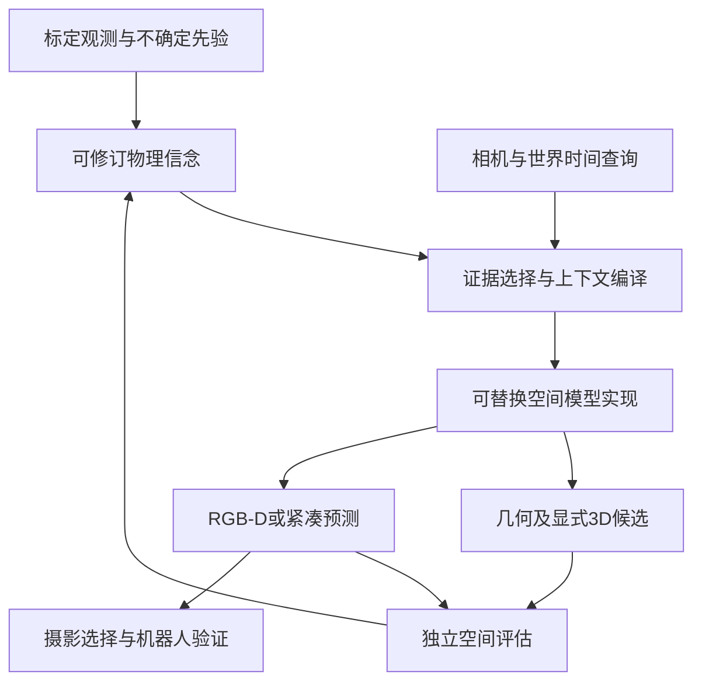

# 从相机可控视频到原生空间世界模型

## 双轨研究计划：空间基础模型与可执行电影摄影

**版本：** 4.0 研究源文档版  
**日期与证据截止：** 2026年9月6日  
**适用项目：** Recomo 影像大脑  
**实验状态：** 已开展文献与评估协议审查；尚未运行模型或机器人基准实验  
**版本关系：** 保留 v1、v2 历史版本及 v3 审计修订，不覆盖旧版  
**引用规则：** P01–P38 对应 [SOURCE_REGISTRY.csv](../SOURCE_REGISTRY.csv)；旧版71项索引仍保留其原有审查范围，不视为全部完成复现。

## 摘要

相机感知生成不是一个单一任务。它涉及标定成像、稀疏视角几何、新视角合成、动态事件重拍、不确定未来预测、持久记忆与交互式世界构建。有效的研究计划应分别比较这些能力，同时检验统一的学习式空间表示能否同时改善其中多项任务。研究既不能根据简短产品披露复制一个想象中的专有架构，也不能收缩成仅面向应用的镜头排序系统。

v4确立两条相互支撑的路线。路线A研究原生空间建模，包括表示、几何条件、重建与生成联合学习、时间动态、记忆以及可控世界创作。路线B以Recomo作为标定实验平台，研究传感器预测、证据获取、摄影规划和物理执行。应用结果用于约束工程投入，但不替代基础模型问题。本版明确纳入Atlas实际使用的重建对照方法，加入带协议限定的数值比较，补充此前缺失的基准与架构类型，并将笼统的创新宣称改为可证伪假设。源文献索引、覆盖记录、结果台账、实验协议及版本保护共同说明每一项结论的依据与边界。文献作者的结果均不作为Recomo复现结果。

## 核心立场

目标空间模型应重建观测支持的部分，在证据不足处表达不确定性，在获得创作授权时生成自洽替代方案，并响应受控的相机与世界时间查询。实现可以先由专业模块通过显式契约协同，再逐步合并权重。研究问题是合并是否改善已测量的能力或效率，而不是架构图里是否只有一个方框。

应用目标与之互补：预测拍摄相机将观察到什么，帮助选择或修订可物理执行的镜头。但应用收益不是研究空间表示、稀疏视角泛化、动态重建和显式3D输出的唯一理由。v3强调的真实决策价值仍作为具身验证保留，不再缩小整个研究主题。

v4坚持三个原则：比较各任务的强基线，而非仅比较CogVideoX、AC3D、RealCam-I2V；每项结果必须附带模型身份、发布配置、输入条件、指标协议及证据成熟度；在学习与执行全过程区分观测、推断假设、创作内容及预测未来。

## 1. 研究范围与双轨目标

路线A检验一种公共空间表示能否支持重建、标定新视角、视频、深度或点图预测、世界时间控制、记忆修订和可编辑3D。潜在贡献可以是观测表示、跨视角机制、多任务目标、考虑不确定性的记忆更新，或更好的精度与计算成本权衡。每一种贡献都需要适当的专业方法对照。接口取一个新名字不构成贡献。

路线B研究这些能力是否改善真实摄影，包括主体构图、光学设置、相机运动可行性、观测获取、预览与实际影像。机器人可以提供普通视频语料缺少的标定与执行证据，但它本身不是对开放域空间智能完整且无偏的测试，仍需独立的非机器人场景和任务。

两条路线共享数据、表示和诊断。路线A的成果可以在尚未改善完整机器人系统时具有科学价值；路线B的某些功能也可能由传统几何更经济地解决。应接受这两种结果，而不是要求所有实验支持预先偏好的统一模型。

## 2. 文献调研方法与审查深度

调研从能力和基准任务出发，而不是受最初三个模型名称限制。应追踪Atlas的明确对照方法、这些论文的方法与评估引用、新的相关工作、官方实现、模型卡及修正通知。与偏好架构相反的证据同样保留：简单几何预测、关键帧优先生成和全局优化都是自回归统一模型的重要替代方案[P05,P08,P13]。

每个来源分别记录身份与摘要核对、定向技术阅读、结果表与协议审计、发布检查和独立复现。这些活动不能压成一个笼统的“已调研”。v4活动索引含38项来源；v3原有71项索引继续保留。两组存在重叠，不能相加后宣称完整阅读了相应数量的独立论文。目前数值摘录集中于三个明确协议，其他覆盖深度仍不均衡，已在覆盖台账中标注。

本工作是有记录的定向综述，不是声称无遗漏的系统综述认证。v4没有运行模型或机器人基准。论文只能支持其披露结果，不能证明我们的实现；代码仓库也不证明所有资源可获取或允许商业使用。本轮发现的WorldReward、WorldExam、CamWorldQA是值得研究的评估方向，但摘要级阅读不支持搬用其全部宣传数字[P24,P25,P26]。

## 3. 能力剖面，而非单一阶梯

同一个模型可能在某一维度领先而在另一维度不足。历史演进可以分阶段讲述，但不能据此给所有模型一个总排序。

| 能力 | 必须区分的条件 | 核心评价问题 |
|---|---|---|
| 相机生成 | 语义运动、数值位姿、射线、尺度锚定 | 是否真的遵循所请求的观测几何？ |
| 重建 | 已知位姿、未知位姿、噪声标定、已观测区域 | 几何是否准确，不确定性是否适当？ |
| 新视角与显式3D | 留出视角、补全、点图、Gaussian | 同一场景能否支持独立新路径和导出？ |
| 动态 | 既有事件重拍与未来预测 | 是否按任务保持或推进世界时间？ |
| 记忆 | 重访、跨路径、纠错、存储成本 | 是否记住正确状态并修订过期状态？ |
| 光学 | 投影、焦距、对焦、光圈、快门 | 成像是否对应给定相机设置？ |
| 世界构建 | 文本、全景、空间锚点、编辑 | 创作是否自洽且不会冒充测量？ |
| 具身 | 传感器、可行性、真实影像 | 预测或规划是否改善实际结果？ |

延迟、显存、训练成本、资源可用性和证据成熟度必须伴随各维度呈现。没有一个综合数字能够证明“整体SOTA”。应比较任务内部结果与多维性能边界。

## 4. 演进是多类设计的交汇

早期相机控制工作建立了位姿条件、与像素对齐的射线和几何对应机制。AC3D研究视频Transformer的相机控制适配；CogVideoX的时空VAE不等于欧氏场景表示。RealCam-I2V官方区分了实验版本与探索性CogVideoX移植。这些是有价值的历史对照，而不是研究范围的上限[P31,P32,P33]。

几何引导生成先搬运可见内容，再预测缺少的外观。GEN3C清楚展示了由深度构建缓存、沿目标相机渲染条件的路线[P30]。优点是降低生成歧义，风险是错误深度或生成证据持续传播。稠密射线和显式缓存都不保证真实尺度或未观测表面。

另一条路线直接研究空间推理。Pi3强调对输入排列的等变性；DA3采用简洁深度—射线目标；MapAnything接受灵活几何先验；CUT3R使用循环空间状态；Glob3R结合基础模型证据和全局优化[P03,P05,P06,P11,P13]。这些不应被当作无需评估的固定预处理器，它们代表几何放在哪里、如何更新的不同假设。

联合模型与系统提供更多选择。Matrix3D研究图像、位姿和深度任务；Rays as Pixels研究相机与视频联合建模；FantasyWorld连接视频与3D预测。4DiM以位姿和时间为条件，这与将相机作为输出生成并不相同[P14,P15,P27,P29]。HY-World 2.0提供完整功能系统和关键帧优先方案[P08]。新范式不意味着旧几何或优化自动失效。

## 5. Atlas是能力参照，不是已知实现蓝图

官方披露涉及带位姿多模态序列、自回归和rectified flow，并展示生成、重建、显式3D、重拍及模拟用途。相机比较同时改变完整模型和输入接口；重建对照明确为Pi3X posed、Pi3、VGGT-Omega 1B、DA3和MapAnything[P01]。

合理推论是研究原生空间接口及多任务迁移，而不是推断未披露的内参格式、元素粒度、内部地图、接触求解器或误差保证。产品能力可能依赖上下文准备、几何融合和模拟组件。因此必须明确“对标”指核心模型、功能流水线还是开放域规模。

专门比较文件覆盖五个重建对照。Atlas图形面板的精确数值没有从二手概述补齐，主源图表转录仍是证据缺口。VGGT-Omega发布的1B模型还附有涉及Tables 1、2结果可能偏高的警告，应核对具体权重与基准重叠，不能据此断言Atlas受到污染或Omega所有用途无效[P02,P38]。

## 6. 已核对数值对研究的具体影响

结果台账为每个值记录来源、表号、版本、数据集、条件、单位及对齐方式。三个例子直接影响架构选择。

DA3 Table 3已知位姿列中，DA3-Giant和DA3-Large的ETH3D F1分别为87.1和75.2；DTU Chamfer则分别为1.85与1.23毫米。较优配置随任务变化。表中的原始VGGT、Pi3不等于Omega、Pi3X，各模型对位姿的使用也可能属于模型条件或后续融合[P05]。

SANA-WM Table 9对同一2.6B/720p主干报告：困难轨迹下双向与自回归阶段一配置的旋转误差分别为3.17度和10.02度，显存分别为49.2与51.1GB。这是特定作者配置，不是最低部署需求；恢复轨迹使用Sim(3)对齐，不能据此证明绝对平移尺度[P07]。

HY-World 2.0 Table 6将仅训练相机控制的WorldStereo配置与其他系统比较；Table 7同时改变潜变量和可训练主干部分，因此不能在缺乏因子实验时把收益全部归因于VAE[P08]。v4使用这些结果设计实验，不拼接跨论文排名，也不由这些表推算Atlas分数。

## 7. 任务形式化与可观测性

设证据集合E由图像、可选几何、相机、内参、时间与来源组成，Q指定目标相机、世界时间、光学及输出。模型估计p(outputs | E,Q,mode)。重建估计已观测状态；新视角合成改变视点；重拍保持已记录事件；预测推进未知状态；创作允许新增内容。任务标签不能混淆。

无畸变针孔相机使用camera-to-world变换(R,o)，像素p对应v=K^{-1}p。当v_z=1时，轴向深度z给出X=o+R(zv)；沿单位射线d的距离r则给出X=o+rd。Plucker线表示只定义观察线，不指定表面位置。畸变与全景相机需要各自的逆投影。

将未锚定单目场景和相机平移统一缩放，可能保持图像投影不变。必须分开任意尺度、外部锚定度量尺度和仅依赖学习先验的度量预测。外部尺度本身也有不确定性；度量测试不能为每个输出重新自由拟合尺度。

预处理属于标定：图像坐标变换A应同步产生K'=AK。毫米焦距必须与传感器尺寸一致。还需规定轴向、手性、变换方向、像素中心、曝光区间和时间潜变量采样。固定的相机输入不是待估计输出，不能机械地给它附加位姿损失。

## 8. 值得验证的科学假设

| 假设 | 拟研究机制 | 必需反证或对照 |
|---|---|---|
| H1：共享空间表示改善多任务 | 几何感知证据表示 | 等数据等计算专业模块；排除额外资源解释 |
| H2：证据排列不应制造场景变化 | 携带时间的等变集合编码 | 置换完整观测元组，不抹去动态时间 |
| H3：关键帧提高大基线控制效率 | 空间关键帧加显式时间合成 | VAE、训练模块、计算量的因子对照 |
| H4：概率条件改善噪声标定使用 | 考虑噪声的位姿与几何先验 | 准确、损坏和缺失条件，对照硬条件输入 |
| H5：可修订记忆避免过期自信 | 有效期与矛盾感知更新 | 检索、显式缓存、循环或隐式记忆 |
| H6：共享假设改善跨路径预测 | 多路径查询同一世界假设 | 等样本等观测的独立生成 |
| H7：生成预测提供具身价值 | 外观、动态预测与证据获取 | 几何规划基线及真实影像风险评价 |

这些是研究提案，不是已证明创新。Pi3、Matrix3D、CUT3R、AW4RE、反事实基准和物理摄影规划均覆盖其中部分思想[P03,P11,P14,P16,P19,P20,P21,P22]。贡献必须明确新机制及相对既有工作的实测收益。

## 9. 竞争架构而非单一路线

A0是必要的模块化基线：标定或学习几何、显式融合、确定性投影、相机条件生成残差。A1先生成带位姿空间关键帧，融合几何，再合成时间连续性。A2采用共享证据编码器、几何与生成分支、模态遮蔽和查询学习。A3采用带类型自回归空间序列与连续输出生成。实验前不预设赢家。

每种架构区分离线与因果配置。离线可访问完整计划轨迹，因果配置不得访问未来测量。蒸馏可以连接两者，但须记录成本和精度损失。未来目标相机可以是用户给定查询，未来真实图像却是额外信息，二者混淆会导致泄漏。

初期候选数量应足够少以保证公平。从A0和一个A1或A2方案开始；当研究问题确实涉及变长多模态续写或上下文复用时，再引入A3。从零预训练是长期选项，不是开展可信空间模型研究的入场条件。

## 10. 公共空间接口

PhysicalWorldBelief管理证据过程，不代表绝对真值；CinematicContinuityState记录已接受艺术选择；RendererLocalCache仍是可丢弃模型状态。SpatialAnchor绑定标定、世界时间和来源，SpatialContextPlan选择支持查询的证据，ContextCompiler执行可测试的变换、掩码、预算和序列化。选择可以学习，编译仍应可检查。

每个输出标明来源证据及假设谱系。测量、重建、估计、生成不能压缩成单一确定性标签。生成帧可以帮助续写，但重复使用不能让一个假设变成多个独立观测。融合、重建和验证必须记录来源依赖。

显式3D产品契约与原生模型token不同。点图、点云、Gaussian和网格用途各异，视觉成功的splat场景不自动成为合格碰撞几何。AnySplat和全局重建方案即便不生成视频，也必须进入比较[P12,P13]。

## 11. 记忆、不确定性与上下文规模

分别测量持久存储、所选上下文和工作张量。有限注意力不等于有限总存储，3D缓存缩小也不等于峰值显存等比例下降。旧版记忆文献继续保留，但具体配置还需结果级复核，不能靠引用数量提升其证据等级。

关键测试是纠错：移动物体、改变光照、加入标定漂移、重新观察被遮挡演员。持续自信地保存过期场景属于失败。置信度应指向可检验事件，例如点误差低于阈值、主体可见性或预测区间覆盖，并在留出结果上校准。来源不等于概率。

更多视角可能改善覆盖，但冗余、噪声或矛盾视角不保证单调收益。应同时绘制误差、校准和运行成本随上下文数量与多样性变化的曲线。排列测试应置换含位姿和时间的完整元组。最近帧、最近位姿、覆盖启发式和学习选择必须使用相同预算。

## 12. 动态与完整相机成像

静态场景加运动相机只是第一种情况。重拍需要同一记录事件的新视角；未来预测需要未观测事件演化的概率分布。CAT4D、ReCamMaster、Track2View属于多视角动态比较，LiveWorld涉及视野外演化[P17,P18,P36,P37]。不能把它们都替换成运动平滑度分数。

非反应场景中的纯相机干预保持事件；会改变接触或引起演员反应的机器人动作则不保持同一未来。这些分支共享初始状态和外生条件，但后续状态依赖动作。必须声明干预谱系和因果范围[P19,P20]。

光学控制也应分阶段。先验证K、投影和变焦，再使用标定数据或合成真值研究对焦、光圈、快门和滚动快门。Dolly和zoom可以维持相似构图却产生不同视差，针孔射线本身不表示有限光圈和运动模糊。UCPE、CameraAnything提供控制研究参照，CineMPC提供物理光学计划参照[P34,P35,P22]。

## 13. 摄影与具身，但不缩小基础研究

路线B将意图变为ShotProgram、可行相机与光学候选、预测、独立评价和本地执行契约。精确数值轨迹可以跳过创作，但不能跳过标定与可行性。模型可以提议轨迹，底盘、机械臂或举升、云台的运动分配仍受物理约束。

纯观测替代方案可以表述为W_k~q(W|E)，Y_jk~p(Y|W_k,C_j)。相同随机种子不证明共享世界，应检查跨路径点、身份与独立真实观测的一致性。会改变世界的动作则必须进入状态转移，不能冻结本应变化的事件。

真实镜头遗憾值是所选候选与固定评估集合中最佳候选的实测价值差，不是相对不可知“艺术全局最优”。构图、遮挡、执行和盲评偏好分别报告，任何合成权重须预先设定。硬安全条件不能用更高美学分数交换。

额外观测只有在降低的预期决策风险足以抵偿采集与处理成本时才有价值，检索和物理采集是不同动作。AW4RE、GenDoP、CineMPC提供相关先例[P16,P21,P22]。新贡献必须落在可验证机制或收益，而非仅增加导演或上下文计划。本地控制仍需处理陈旧地图、动态障碍、执行器限制和停止行为。

## 14. 数据与干预设计

训练数据应包括精确合成几何、标定真实多视角、同步动态采集和有许可的伪标定视频。保存原始观测身份、场景与会话、标定修订、位姿来源、深度定义、演员身份、世界时间、使用权限和置信来源。公共数据拓宽领域，Recomo采集提供计划路径、执行路径及真实影像。

按场景、演员、资产家族和采集会话划分训练测试，同一根场景的干预分支留在同一划分。记录伪标签生成器是否也是最终评估器。精确合成数据可检验机制，但不能独立证明对玻璃、反射、形变和真实标定误差的泛化。

多次动态表演不是同一事件的精确反事实。采用同步视角、可重复受控运动或模拟，并明确真值类型。精确和优化标定分开保存。PIVOT对此提供实用协议，但初始五个无人机场景不代表完整摄影数据集[P10]。

## 15. 评估计划：基础模型与具身门槛

E0用尺度、裁剪、变换、深度和时序错误注入检验契约与评估器。F1比较未知位姿、准确位姿、噪声位姿和尺度锚定下的几何专业方法；F2比较标定生成及关键帧与视频潜变量；F3检验联合学习、排列敏感性和任务干扰；F4检验持久性、动态重拍及显式3D。E1比较离线与因果服务配置，E2检验纠错、不确定性和证据选择，E3评价真实传感器预测和镜头选择。详见EXPERIMENTS.md。

WorldScore评价跨场景控制、质量与动态；PIVOT分层处理轨迹和标定；WorldExam、CamWorldQA、WorldArena及干预基准覆盖不同诊断维度，均不能完全替代标定几何和真实执行[P09,P10,P19,P20,P25,P26,P28]。WorldReward等学习奖励可以辅助训练和排序，但必须独立验证，不能成为自我认证的真值[P24]。

分别报告生成失败、已证实几何错误、评估器不收敛和弃权，不静默删除样本，也不把每次估计器失败自动归因于生成器。至少保留一个不同于训练标签估计器的几何诊断。置信区间按场景或会话重采样，不将相关帧当独立样本。记录所有采样与重试，不允许未披露的best-of-N。

## 16. 训练与资源策略

从已有几何和视觉先验开始，共享编码器或解码器之前先建立专业基线。可用模态遮蔽和查询任务测试迁移，但各任务单独评分。损失只作用于预测变量，重投影需有效对应、可见性和动态掩码。只有假设要求时才添加相机输出、新深度VAE或循环隐状态。

先进行短静态多视角学习再扩展长动态续写，同时尽早加入动态诊断，避免过晚发现偏差。主训练、适配、因果转换、蒸馏、精修的成本分别报告。SolarWM是数据与训练系统参照，但分阶段发布和上游权利不能忽略[P23]。

24GB目标必须对应实际测量配置，而不是参数量承诺。统计权重、激活、时间潜变量、VAE、注意力状态、空间记忆、精修和加载开销，offload还须报告主存与延迟。小型实验可使用adapter或紧凑预测器；基础模型规模投入必须以具体失败及扩容理由为依据。

## 17. 路线图与决策权限

G0冻结任务、相机语义、评估器负对照及证据记录；G1复现一个强几何与一个强生成基线；G2围绕具体失败选择A0–A3对照；G3研究多任务迁移和上下文规模；G4研究动态、修订和显式3D；G5研究Recomo预测及真实决策；G6才决定扩大训练或产品部署。这些是证据依赖，不是时间承诺。

共享正确性测试通过后，A、B路线可以并行。具有科学价值的表示研究不必等待完整机器人集成；产品也可采用经济几何方案，同时继续基础研究。每项实验与计算预算都应绑定明确问题，不能以“追平Atlas”为无限投入名目。

发布卡分别记录代码、权重、训练数据、生成输出、再分发和teacher资格。开放代码不等于一揽子许可。受限或尚不可用的系统可以作为参照，却不必成为产品依赖。文档测试不认证安全或法律合规。

## 18. 版本治理、限制与最终建议

v4是新的连贯源文档，不静默修改v1、v2、v3。原始对话v2与仓库较短v2是不同文本，完整原始字节恢复仍是独立待办；主题映射不等于无损导入。v3的38项处理记录与历史引用均保持可访问且不变。

本版解决的是研究范围、比较集合及协议设计的编辑问题，不代表已解决Atlas图表缺失、全文覆盖不均、权重复现、统计性能证明、商业权限或物理验证。源文档测试验证链接、身份、记录和版本边界，不验证科学真值或独立翻译等价。

建议继续原生空间模型研究，同时保留多种实现与一个标定应用伙伴。联合学习确有收益时联合；专业方法更强时保留专业方法；将纠错和执行所需证据显式化；并行衡量空间能力与具身价值。Atlas对等系统仍是合理目标，但通往目标的路线应是一系列可证伪进展，而非模仿未披露网络，也不是把空间智能缩减为镜头排序。

## 配套材料

[Atlas比较](../ATLAS_COMPARISON.md) · [文献覆盖](../LITERATURE_COVERAGE.csv) · [结果台账](../RESULTS.csv) · [实验协议](../EXPERIMENTS.md) · [架构决策](../ARCHITECTURE.md) · [路线图](../ROADMAP.md) · [来源索引](../SOURCE_REGISTRY.csv) · [版本清单](../VERSION_MANIFEST.json)
